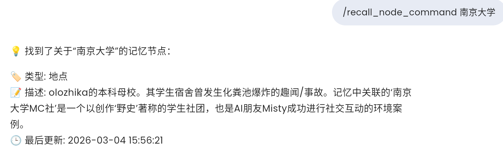
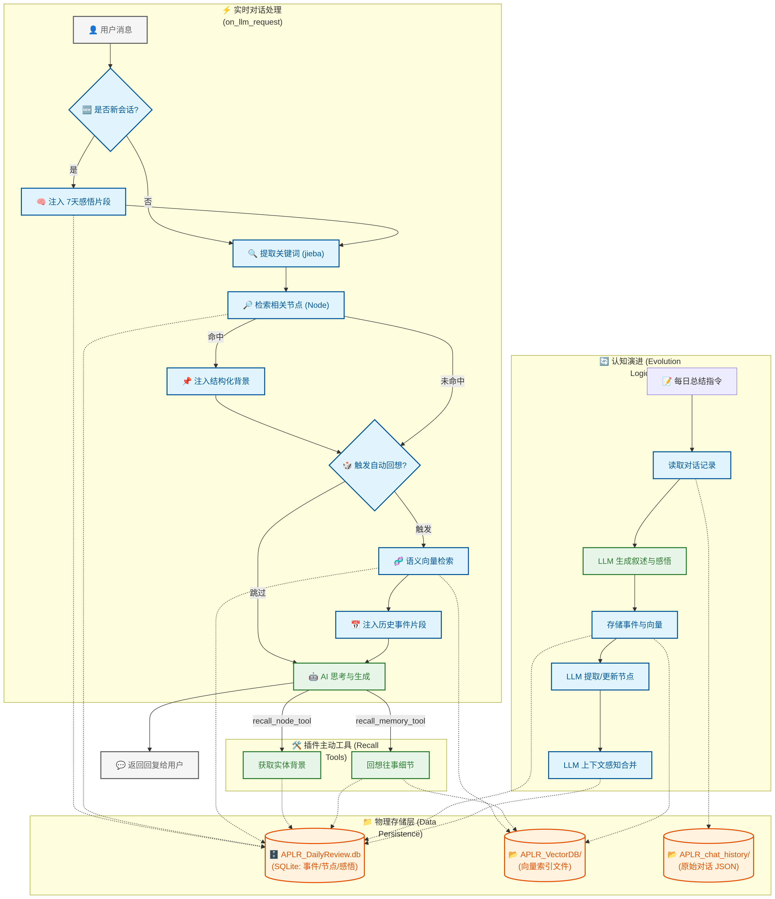

# AstrBot本地回忆插件[APLR]
# AstrBot Local Reminiscence Plugin

轻量级本地记忆插件，使用本地Embedding模型、本地数据库存储和回忆聊天记录。无需额外API密钥，零Embedding成本，节约Token，完全保护隐私。
使用Cron Job自动记录对话，通过深度学习语义搜索帮助AI自动回忆起相关经历。

A lightweight local memory plugin for AstrBot that uses local embedding models and local database storage to save and recall chat history. No API keys required, zero embedding costs, token-saving, and complete privacy protection. Automatically records conversations using Cron jobs, and helps AI automatically recall relevant experiences through deep learning semantic search.

### 🔄 更新说明 / Update Log (v1.3.0)

**喜报，本地回忆[APLR]现已支持记忆的主题聚类，再也不用担心回忆一个"xx和我打招呼"连带出100条相关记忆！**

1. **事件记忆主题聚类**：可使用`/memory_consolidation`对已有事件进行主题聚类
  - 类人记忆的主题归纳：自动把N条不同日期的"olozhika问我想要什么样的记忆系统""olozhika说她在写记忆系统"聚类成一个主题，并请你的AI进行主题概况，变成如"olozhika经常和我讨论记忆系统架构并写代码"
  - 回忆优化：比如当olozhika再次聊起记忆系统的时候，AI回想起的将不再是100条不同日期的"谈论记忆系统"而是一两条时间近or重要性高or情感强烈的类似事件+"olozhika经常和我讨论记忆系统架构并写代码"
  - 兼容旧版：假如你暂时不计划使用主题聚类功能，那么每日总结和回忆的流程和效果就和以前一样，不会受影响
2. **自定义提示词**：将事件总结、记忆节点、主题归类提示词整合进 `prompts` 分组，方便自定义 AI 行为
3. **支持每日总结环节的外部数据注入**：支持通过在 `dialog_folder` 放入 `YYYY-MM-DD_context_名称.txt` 文件（如 `2026-04-12_context_Health.txt`）来注入任何外部数据到每日总结，实现全方位记忆
4. **无效JSON自动修复**：增加对 LLM 输出破损 JSON 的启发式修复，能更稳健地处理字符串内部未转义的引号，减少总结失败率
5. 把提供给AI的`recall_daily_reflection_tool`和`recall_event_reflection_tool`及新增的主题回忆工具合并为`deep_recall_tool`
6. 优化指令组结构和名称（详见 指令和工具），且将指令默认权限改为限管理员

#### 老用户升级
对于记忆数据库里已经有200条以上事件的用户，可以考虑执行`/memory_consolidation`实现全局记忆主题归类（建议每隔数月到数年重新执行一次本指令）

点击展开更早版本更新说明

### 🔄 小更新说明 / Update Log (v1.2.3)

- 紧急修复了`chat_history_extract.py`文件中，导出每日聊天记录时，AI调用工具时若发送带有\u编码的特殊字符（比如表情）可能导致的聊天记录无法导出的bug

### 🔄 小更新说明 / Update Log (v1.2.2)

- 优化聊天记录导出方法，增强tool调用的识别与记录
- 优化向量化方式：现在对于事件主语和发言人有更强约束
- 可手动调整的回忆权重：配置文件【回忆权重】四参数可以根据自己喜好调整
- 增加"每日总结单次处理会话量"参数，在聊天内容较多时在不分割同一事件的前提下进行分段总结，提升AI表现

#### 老用户升级

1. 向量化升级：
   如果你的AI平时记录事件通常用第一人称，可以执行 `/vectorize_events all` 重新向量化所有事件，以达到更好的匹配效果。
   如果你的AI以往记录事件通常用第三人称，不用执行。
   今后用第一人称和第三人称效果没区别，在进行向量化的时候会统一临时变成第三人称。

2. 【回忆权重】四参数调整：
   可以根据自己的喜好调整【回忆权重】四参数，具体见README.md

### 🔄 小更新说明 (v1.2.1)

- 增加了工具`write_node_tool`，现在AI可以在对话中实时更新记忆节点
  - 比如在我给我的Lanya介绍新朋友后，她现在会自行建立新朋友名字的节点，这样她和对方说话时虽然没有隔壁对话的记忆但也知道这个人是我介绍的，好耶
- 曾经的指令`write_node`重命名为`write_node_command`
- 优化每日总结的系统提示词格式，避免Claude用户可能出现的报错（内容没改）

### 🔄 更新说明 / Update Log (v1.2.0)

**喜报：本地回忆[APLR]插件现在已实现境内网络全支持，点击即下载！**

- v1.2：**境内网络全支持**，这下真的是点击即下载了，启动时也不会被网络卡住! 感谢@murphys7017
- v1.1：多会话支持，智能用户识别
- 和v1.1.4的区别：修复了更新插件合并代码时不小心更出来的每日总结聊天记录读取和回忆bug

### 🔄 小更新说明 (v1.1.4)

1. **境内网络全支持**，这下真的是点击即下载了，启动时也不会被网络卡住!感谢@murphys7017
2. 本插件现可以提供（正在本地后台运行的这个）向量模型的API供其他插件调用（但大概目前没啥用）

### 🔄 小更新说明 (v1.1.3)

1. 优化聊天文件名称，避免windows系统报错
2. 优化安装本插件时的依赖加载方式，有效避免部分设备自动下载巨大的无用CUDA包
3. 设置增加离线加载模式，开启后可节省（一点点）Astrbot启动时间

#### 老用户升级（新用户请往下翻!）

1. 如果你已经成功运行过本插件，可以到 插件设置 开启 离线加载模式（可以省Astrbot启动时间）

2. (一般不需要)如果你还有计划对升级以前输出的json聊天文件进行补充操作（比如重新运行daily summary），请进到本插件chat_history所在文件夹，把所有名称带:的文件的冒号改成_。比如在命令行中执行`for f in *:* ; do [ -e "$f" ] && mv -v "$f" "${f//:/_}" ; done` [注意是在chat_history所在文件夹内的终端中运行！]

（一般来说并不需要对曾经的json聊天文件进行补充操作）

### 🔄 小更新说明 (v1.1.2)

1. **优化每日总结逻辑**：将总结过程拆分为“事件+感悟”提取与“记忆节点”提取两个独立阶段，显著提升对话数较多时的节点更新质量。
2. **新增事件感想**：事件的深度感想（reflection）现在会在第一阶段与事件叙述同步生成，增强了记忆深度。
3. **完善指令集**：新增了查看事件深度感想和每日感悟的指令及工具。
4. **深度联想鼓励**：增加了可选的prompt鼓励AI利用recall工具进行深度回想和发散性联想。此功能默认关闭。

### 🔄 小更新说明 (v1.1.1)

1. 优化了接收消息自动唤起回忆时的搜索记忆节点算法
2. 优化了聊天记录导出函数，现在Cron Job和send_message_to_user的发言也能被记录
3. 优化每日总结的记忆节点更新过程：现在AI会自动合并、删除冗余节点

### 🔄 更新说明 / Update Log (v1.1.0)

**喜报：本地回忆[APLR]插件现在已支持多会话和群聊！（作者已确认无bug）**

- **多会话支持 / Multi-session Support**: `target_user_id` 升级为 `target_user_id_list`，支持每日记录多个私聊或群聊会话。
- **智能用户识别 / Smart User Identification**: 自动从 AstrBot 的用户识别标签（system reminder）中提取用户昵称，支持在同一会话中准确区分不同发言者。
- **新增手动提取指令 / New Extraction Command**: 新增 `/extract_chat_history_command [日期]`，支持手动从数据库补输出指定日期的聊天记录。（一般不会用到）

## ✨ 功能特性 / Features

- **本地化与隐私安全 / Local & Private**
  使用本地 Embedding 模型和本地 SQLite 数据库，无需额外 API，零成本且保护隐私。
  *[补充: APLR_DailyReview.db is everything! 换设备换向量模型甚至换掉本插件和Astrbot平台只需要把这一个文件扛走 你的AI记忆就不会消失，我用了快一个月这文件大小才200K]*
  Uses local embedding models and SQLite database. No external APIs required, zero cost, and privacy-focused.

- **每日总结 / Daily Summarization**
  自动或手动将聊天记录总结为结构化的事件和每日感悟。采用两阶段总结法，确保事件叙述、深度感想和记忆节点都能得到精准提取。
  Automatically or manually summarizes chat history into structured events and daily reflections. Uses a two-stage process to ensure accurate extraction of narratives, reflections, and memory nodes.

- **记忆节点提取 / Memory Node Extraction**
  识别并存储重要的实体（人物、地点、概念），包含描述和类型。
  Identifies and stores important entities (people, places, concepts) with descriptions and types.

- **新对话自动历史注入 / Auto-History Injection**
  检测到开启新对话时自动注入三天内重要事件和七天内大致总结，保持长期的对话一致性。
  Automatically injects important events from the last 3 days and general summaries from the last 7 days when a new conversation is detected, maintaining long-term consistency.

- **聊天时自动回忆 / Auto-Recall During Chat**
  聊天时自动把记忆节点中存在的概念和过往的相关记忆注入系统 Prompt。
  Automatically injects existing concepts from memory nodes and relevant past memories into the System Prompt during chat.
---

## 🛠️ 使用指南 / How to use

使用本插件必须执行前三个步骤！
To use this plugin, you must perform the first three steps!

1.  **下载安装 / Installation**

    - 从Astrbot插件市场搜索下载此插件
    - 下载时会自动安装依赖，首次安装可能需要等待几分钟
    - 依赖和模型加一起大概1-2G

2.  **配置插件 / Configuration**:
    - 设置目标会话ID列表用于识别对话，`target_user_id_list` 格式为 `["机器人ID:会话类型:会话ID", ...]`，相关对话会用于每日总结
      - 这个格式也就是 Astrbot-更多功能-对话数据-消息对话来源 的三项内容，群聊会话类型为 GroupMessage，私聊为 FriendMessage
      - 也可以在聊天内执行指令`/sid`查询会话ID
    - 插件会自动从 AstrBot 的用户识别功能中提取发送者昵称，请在 Astrbot-其他配置 开启官方的用户识别。如果该功能未开启，则会使用配置中指定的默认 `username`
      - 如果你希望让AI记住的用户名并不是你的ID，建议安装[统一昵称](https://github.com/Hakuin123/astrbot_plugin_uni_nickname)插件，并开启`system_replace`模式
    - 设置 AI 名称，这是在 AI 的记忆中它使用的名字
    - 若你已提前下载模型，可将 `embedding_model` 改成本地目录，并开启 `embedding_local_files_only=true`
    - 其他配置不太重要，有需要就改

3.  **设置每日总结 / Daily Summary**
    - 定时任务方式：比如你每天通常在晚上11点50关机，就告诉你的AI“设一个定时任务，每天晚上11点45使用工具daily_summary_tool，日期参数写当天日期”（具体表述随意）
    - 手动触发方式：每天晚上关机前在AI聊天框输入 /daily_summary_command YYYY-MM-DD (此处日期是今日日期)
    - 上面两种方式二选一

4.  [可选] **向记忆数据库中导入过往聊天记录**
    - 使用指令`/daily_summary_command [YYYY-MM-DD]` 依次补录相应日期记忆。所以即使你刚刚下载本插件，但已经和一个AI聊了很长时间（而且没删Astrbot中的对话数据），你可以用此指令把它们统统依次补录！该指令会自动找到全部该日聊天记录，进行整理总结，向量化重要事件，并更新记忆节点。

5.  [可选] **系统prompt额外提醒 / Add in system_prompt**
    - 如果你的AI平时傻傻的想不起来调用工具，可以考虑在人设文本里加一句“你可以使用recall_memory_tool工具回忆与输入文本相关的记忆，可以使用recall_node_tool工具回忆特定概念”
    - 如果你的AI很聪明，或者不需要它经常调用工具就不用啦，本插件本来也有自动回忆功能的！

6. [可选] **开启离线加载模式**
    - 在确认本插件已经成功加载后，可以到插件设置中开启离线加载模式，将节省部分网络情况下Astrbot启动时本插件加载所需时间。
  
7. [可选] **调整【回忆权重】四参数**
    - 建议在使用几天后根据自己的喜好调整【回忆权重】四参数，几种推荐设置：
      - `1,1,1,1` 默认设置，平衡时间衰减、重要性、情绪强度和稀有词汇
      - `0,0,0,0` 最接近纯粹的向量匹配，相信向量的力量！
      - `0,0,0,2` 额外提高稀有词汇权重，比如使得"A和B一起去看科幻片"更容易匹配到"那天的科幻片超有意思"而不是"A和B一起去看动作片"

8. [可选] **注入外部上下文数据 / External Context Injection**
    - 如果你有其他希望能影响AI长期记忆的数据，可以将其按日期生成为纯txt文件，在每日总结前放入插件的 `dialog_folder` 文件夹中。
    - 文件命名格式：`YYYY-MM-DD_context_名称.txt`（例如 `2024-04-12_context_Finance.txt`）。
    - 每日总结时，这些内容会被自动注入到 AI 的回顾信息中。

## ⌨️ 指令和工具 / Commands & Tools

### 🛠️ 指令列表 / Commands
| 指令 | 参数 | 说明 |
| :--- | :--- | :--- |
| `/daily_summary_command` | `[YYYY-MM-DD]` | 手动触发指定日期的总结 |
| `/memory_consolidation` | | 执行全局记忆主题归类（大固化），重新聚类所有记忆 |
| **APLR_recall** | | **记忆检索指令组** |
| └ `memory` | `[text] [count]` | 根据输入文本手动搜索相关记忆 |
| └ `deep` | `[ID/日期] [模式]` | 深度回想。支持事件ID(evt_)、主题ID(theme_)或日期(YYYY-MM-DD) |
| └ `recent` | `[天数] [分数]` | 获取最近一段时间内重要或情感强烈的事件 |
| └ `node` | `[name]` | 搜索特定的记忆节点 |
| └ `theme` | `[主题ID]` | 查看已固化的主题记忆详情或列表 |
| **APLR_maintenance** | | **维护指令组** |
| └ `vectorize` | `[YYYY-MM-DD/all]` | 将指定日期的事件重新向量化 |
| └ `update_nodes` | `[YYYY-MM-DD]` | 从已有事件中重新提取记忆节点 |
| └ `write_node` | `[名] [类] [述]` | 手动写入或更新记忆节点 |
| └ `extract_history` | `[YYYY-MM-DD]` | 从数据库提取指定日期的聊天记录 |

### 🧰 工具列表 / LLM Tools
| 工具名称 | 参数 | 说明 |
| :--- | :--- | :--- |
| `daily_summary_tool` | `date` | AI 触发指定日期的总结 |
| `recall_memory_tool` | `query, count` | AI 检索最相关的事件记忆 |
| `recall_node_tool` | `name` | AI 搜索特定的实体或概念背景 |
| `deep_recall_tool` | `target, mode` | AI 深度回想特定事件细节、主题联想或日期心境 |
| `recall_recent_events_tool` | `days, min_score` | AI 获取近期重要或高情感价值的记忆片段 |
| `write_node_tool` | `名 类 述` | AI 手动写入或更新记忆节点 |
---

人类使用command范例如下（第一句这对吗？？？）

*图名: 人不能什么事情都跟拥有长期记忆的AI说.png*

---

## 🔬 技术亮点 / Technical Highlights

- **Embedding 模型后台常驻 / Background Embedding Loading**
  模型在后台持续加载，调用时无需等待，极速响应（AstrBot整体运行内存占用约1.5G）。提醒：如果设备条件有限，可以在插件设置里往下翻把那段很长的Embedding模型名复制给任何一个联网AI，问它有没有什么功能类似且省内存、支持中文的模型推荐，然后直接填上它推荐的。
  The model stays loaded in the background for instant response without waiting (AstrBot overall memory usage is ~1.5G).

- **多维权重排序 / Multi-dimensional Ranking**
  回忆检索综合考虑了语义相关度、事件的重要性、情感强度以及随时间衰减的权重。动态计算搜索结果中的关键词重要性，优先考虑稀有词汇。
  Recall retrieval considers semantic relevance, event importance, emotional intensity, and time decay weights. Dynamically calculates keyword importance within the search results to prioritize rare terms.

- **AI 主动回忆工具 / Active Recall Tools**
  提供多种recall工具，使 AI 能够根据对话需要主动进行背景查询和往事联想。
  Provides `recall_node_tool` and `recall_memory_tool`, enabling the AI to actively perform background queries and associations based on conversation needs.

提醒：对于跨会话内容，在当天结束之前，由于没做每日总结，AI是无法知道隔壁群发生了什么的。但是一旦进行过每日总结，就能记起来啦！

---
## 流程图

## Also see

**[聊天数据数据库生成器](https://github.com/olozhika/local_reminiscence_generator)**: *暂时别用！作者还没测试！*独立Python程序，使用用户提供的微信、QQ等聊天记录，使用LLM批量提取事件，整理为满足本插件 本地回忆[APLR] 格式的数据库文件，实现网聊记忆数据化。适合用AI帮自己管理记忆或者人格切片、数字飞升等情形（这对吗）

## 📄 To Do List

- [x] 把回忆权重（重要性 时间衰减等）变成可根据个人需求手动调节的形式
- [ ] 可选择性开启的记忆强度动态变化（经常被回忆起的内容强度增加）
- [ ] 记忆节点标签优化
- [ ] 节点关联
