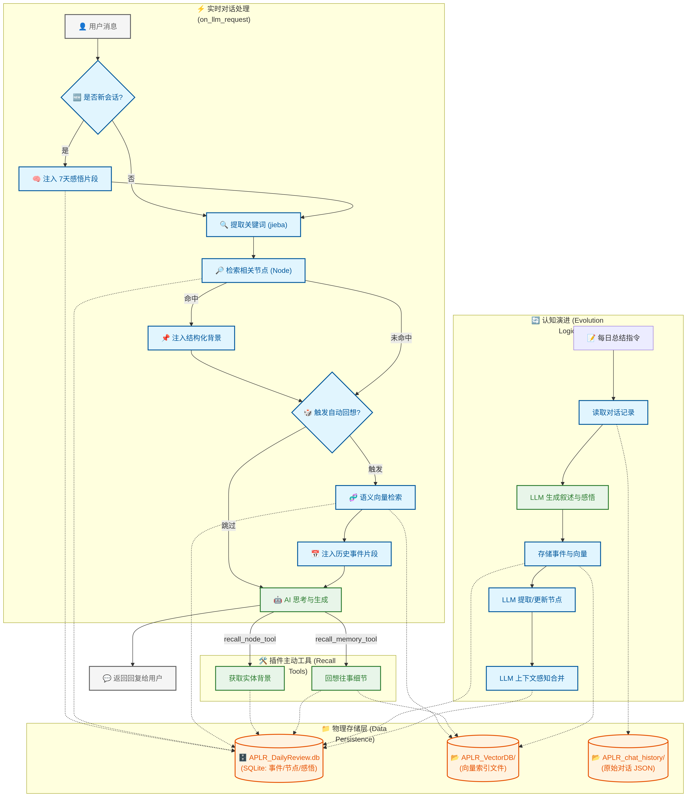

# AstrBot 本地回忆插件 [APLR]

**Local Reminiscence Plugin** — 轻量级本地记忆插件。使用本地 Embedding 模型 + SQLite + ChromaDB，零 API 成本，完全保护隐私。

## 快速入门

1. 从 AstrBot 插件市场安装，等待依赖下载完成
2. 发 `/sid` 获取会话 ID，填入 `target_user_id_list`
3. 设置每日总结（Cron Job / 手动指令 / 自动触发三选一）
4. 通过 `/daily_summary_command YYYY-MM-DD` 补录历史聊天

> 详细使用说明请参阅 [USAGE.md](./USAGE.md)

## 功能概览

- **每日总结** — 两阶段 LLM 总结：先提取事件 + 感悟，再提取/更新记忆节点
- **记忆节点** — 长期记忆实体（人物、地点、概念），支持别名匹配和事件关联
- **主题聚类** — 事件数量过多时自动聚类，提高回忆精准度
- **自动回忆** — 新对话自动注入近期重要事件和相关节点
- **深度回想工具** — AI 可主动调用 `recall_memory_tool`、`deep_recall_tool` 等进行往事联想
- **外部数据注入** — 通过 `context.txt` 文件向每日总结注入外部信息

## 核心文件

| 文件 | 说明 |
|------|------|
| `APLR_DailyReview.db` | 记忆数据库（SQLite），备份此文件即可迁移全部记忆 |
| `APLR_VectorDB/` | ChromaDB 向量数据库目录 |
| `APLR_chat_history/` | 聊天记录 JSON 文件 |
| `APLR_ModelCache/` | Embedding 模型缓存 |

## 流程图

## Also see

**[聊天数据数据库生成器](https://github.com/olozhika/local_reminiscence_generator)** — 独立 Python 程序，用微信/QQ 等聊天记录生成 APLR 格式的数据库文件。

## To Do

- [ ] 可选的定期自动备份记忆数据库
- [ ] 可选的 cron job 完整记录补充
- [ ] 让用户自己选择是否把 AI 工具调用记入聊天日志
- [ ] 可选择性开启的记忆强度动态变化（经常被回忆起的内容强度增加）
- [ ] 记忆节点标签优化
