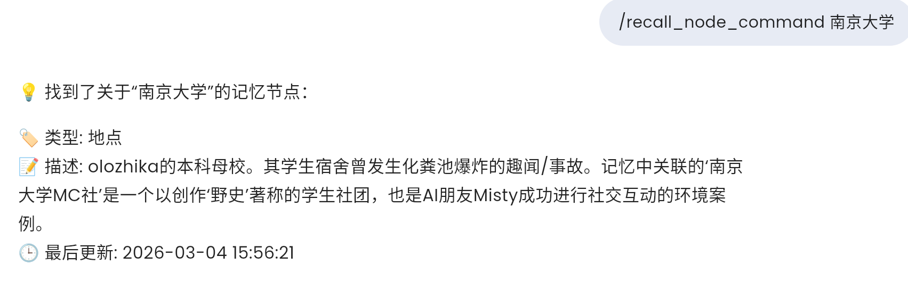

# AstrBot本地回忆插件[APLR]
# AstrBot Local Reminiscence Plugin

轻量级本地记忆插件，使用本地Embedding模型、本地数据库存储和回忆聊天记录。无需额外API密钥，零Embedding成本，节约Token，完全保护隐私。
使用Cron Job自动记录对话，通过深度学习语义搜索帮助AI自动回忆起相关经历。

A lightweight local memory plugin for AstrBot that uses local embedding models and local database storage to save and recall chat history. No API keys required, zero embedding costs, token-saving, and complete privacy protection. Automatically records conversations using Cron jobs, and helps AI automatically recall relevant experiences through deep learning semantic search.

## 快速入门

1. 从 AstrBot 插件市场安装
2. 发 `/sid` 获取会话 ID，填入 `target_user_id_list`
3. 设置每日总结（Cron Job / 手动指令 / 自动触发三选一）
4. 通过 `/daily_summary_command YYYY-MM-DD` 补录历史聊天

注：使用本插件需要装Astrbot的盘符有2G以上剩余空间且运行Astrbot的设备有4G及以上内存

> 详细使用说明请参阅 [USAGE.md](./USAGE.md)

## 功能概览

- **每日总结** — 每日结束时将聊天记录整理为长期记忆数据库中的`事件`和`节点`
- **节点关联** — 实体记忆(比如人物 场地)作为`节点`串联所有`事件`
- **主题聚类** — 相近事件自动聚类，提高回忆精准度
- **自动回忆** — 新对话自动注入近期重要事件和相关节点，聊天过程中自动注入相应概念
- **深度回想工具** — AI 可主动调用 `recall_memory_tool`、`deep_recall_tool` 等进行往事联想
- **外部数据注入** — 支持各位开发者通过 `context.txt` 文件向每日总结注入外部信息以便实现更多个性化需求

## 核心文件

| 文件 | 说明 |
|------|------|
| `APLR_DailyReview.db` | 记忆数据库（SQLite），备份此文件即可迁移全部记忆 |
| `APLR_VectorDB/` | ChromaDB 向量数据库目录 |
| `APLR_chat_history/` | 聊天记录 JSON 文件 |
| `APLR_ModelCache/` | Embedding 模型缓存 |

## 流程图

## 人类偷看AI记忆结果范例（第一句这对吗？？？）

*图名: 人不能什么事情都跟拥有长期记忆的AI说.png*

## Also see

**[聊天数据数据库生成器](https://github.com/olozhika/local_reminiscence_generator)** — 独立Python程序，使用用户提供的微信、QQ等聊天记录，使用LLM批量提取事件，整理为满足本插件 本地回忆[APLR] 格式的数据库文件，实现网聊记忆数据化。适合用AI帮自己管理记忆，或者人格切片、数字飞升等情形（这对吗）

## To Do

- [ ] 可选的定期自动备份记忆数据库
- [ ] 可选的 cron job 完整记录补充
- [ ] 让用户自己选择是否把 AI 工具调用记入聊天日志
- [ ] 可选择性开启的记忆强度动态变化（经常被回忆起的内容强度增加）
- [ ] 记忆节点标签优化
- [ ] 可选的定时概率性重新总结节点（每日总结完成后，根据用户指定的概率，把 LLM 刚才更新过的节点及其关联事件整体呈现给 LLM，获得更整体的认知概念，优化节点表述）
- [ ] 定期自动节点去重（通过关联事件自动发现描述同一事物的冗余节点并合并）
- [ ] LLM 获得其他工具返回结果时（如阅读完贴文、搜索结果等）自动概率性唤起相关记忆匹配
- [ ] 节点直接关联查询工具：给定一个节点名，返回所有与其有共享事件的关联节点列表（用于"群里都有谁"、"谁认识谁"等查询场景）
